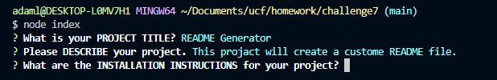
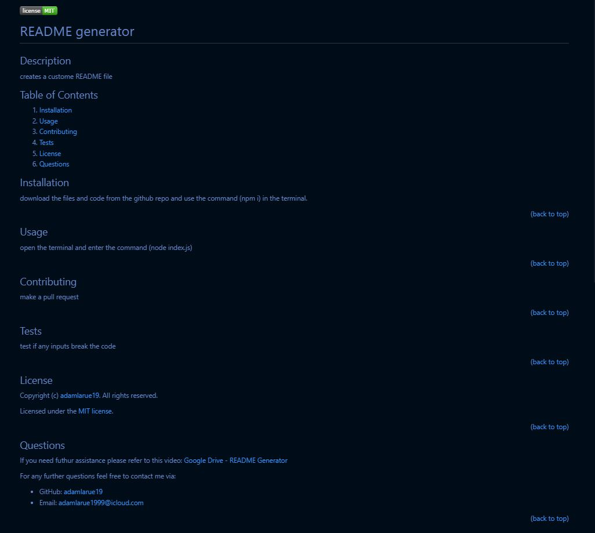

# README generator

## Description
creates a custome README file

## Table of Contents
1. [Installation](#installation)
2. [Usage](#usage)
3. [Contributing](#contributing)
4. [Tests](#tests)
5. [License](#license)
6. [Questions](#questions)

## Installation
download the files and code from the github repo and use the command (npm i) in the terminal.

(<a href="#readme-top">back to top</a>)

## Usage
open the terminal and enter the command (node index.js)

once all inputs have been put in, the README file will be created

(<a href="#readme-top">back to top</a>)

## Contributing
make a pull request

(<a href="#readme-top">back to top</a>)

## Tests
test if any inputs break the code

(<a href="#readme-top">back to top</a>)

## License
Copyright (c) [adamlarue19](https://github.com/adamlarue19). All rights reserved. 

Licensed under the [MIT license](https://choosealicense.com/licenses/mit/).

(<a href="#readme-top">back to top</a>)

## Questions
If you need futhur assistance please refer to this video: [Google Drive - README Generator](https://drive.google.com/file/d/1jpeHOR8YeXiwp-GIEt0Ejp8FU8H8AaBw/view?usp=drivesdk)

For any further questions feel free to contact me via:
- GitHub: [adamlarue19](https://github.com/adamlarue19)
- Email: [adamlarue1999@icloud.com](mailto:adamlarue1999@icloud.com)

(<a href="#readme-top">back to top</a>)

